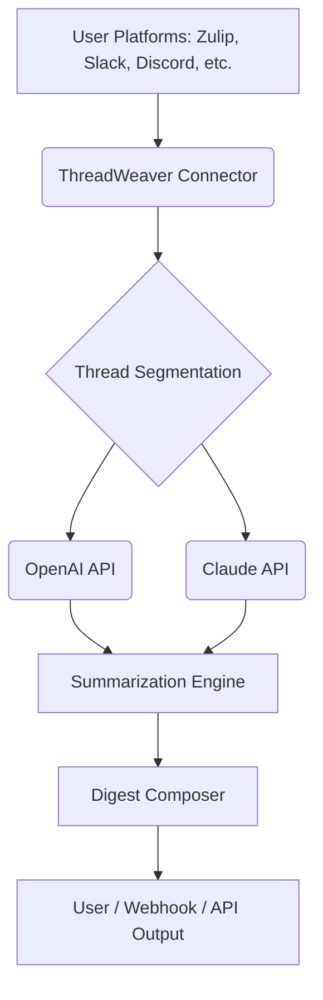

# NAME: ThreadWeaver – Intelligent Multi-Platform Chat Thread Summarizer

*Instantly harvest the signal from your messaging noise: Smart, AI-powered summarization and topic tracking for all your chat ecosystems using pluggable, containerized bots. Integrates OpenAI & Claude with ease.*

---

## ⬇️ Download ThreadWeaver!

Get started with ThreadWeaver right away:

---

## 🧵 About ThreadWeaver

**ThreadWeaver** is an avant-garde, Dockerized bot framework that stitches intelligence into your messaging workflows. Unifying conversations from platforms like Zulip, Slack, Discord, and others, it delivers AI-powered thread summarization, keyword scanning, and sentiment-lit reports—all without disruptive server changes. Plug in your favorite Large Language Models, including OpenAI and Claude, for highly relevant and context-aware results.

No more sifting through endless chat logs: ThreadWeaver surfaces knowledge, actions, and opinions into clear, crisp summaries—helpful for teams, community managers, researchers, and those fed up with information overload.

---

## 🚀 Key Features

- **✨ Thread-Smart Summarizer**: AI lets you distill chaotic threads into digestible, link-rich overviews.
- **🗝️ Keyword and Entity Extraction**: Highlights vital people, places, and buzzwords, cross-platform.
- **🕓 Always-On Agent**: 24/7 conversation curation—catch every update, even across time zones.
- **🌏 Multilingual**: ThreadWeaver weaves meaning from dozens of languages, ensuring inclusiveness.
- **🤖 Modular, Pluggable Connectors**: Add messaging platforms as needed with minimal friction.
- **🖥️ Responsive & Intuitive TUI**: Clean, terminal-based User Interface with real-time updating.
- **🔄 API Ready**: Extend with webhooks or custom integrations for your workflows.
- **🔐 Secure by Design**: Tokens and credentials are pluggable, encrypted at rest.
- **🏆 24/7 Community Support**: Get help any hour, every day, via the built-in support bot.

---

## 💡 SEO-Friendly Highlights

- **AI Thread Summarizer for Slack, Zulip, Discord, Teams**
- **Automated conversation digests for technical and non-technical users**
- **OpenAI & Claude API integration for natural language mastery**
- **Multi-platform, container-friendly chatbot for enterprise and communities**
- **Multilingual, user-friendly, customizable chat thread analysis**

---

## 🌐 Supported Operating Systems

|  OS         | Supported? | Native Binaries | Docker Images |
|:------------|:----------:|:---------------:|:-------------:|
|     | ✅ | ✅ | ✅ |
|     | ✅ | ✔️ | ✔️ |
|      | ✅ | ✔️ | ✔️ |
|                     | ⚠️ | ❌ | ✅ |
|   | 🌍 | - | 🎉 |

---

## 🔍 Mermaid Diagram – ThreadWeaver System Architecture

---

## 📝 Example Profile Configuration

ThreadWeaver is configured using a simple YAML profile:

    platform_connectors:
      - platform: "zulip"
        api_key: "YOUR_ZULIP_KEY"
        server_url: "https://chat.example.com"
      - platform: "slack"
        api_token: "xoxp-XXX"
    summarizer_engine:
      provider: "openai"
      api_key: "sk-YOURKEY"
      model: "gpt-4"
    additional_summarizer:
      provider: "claude"
      api_token: "uh-ANOTHERKEY"
      max_threads: 5
    output:
      digest_webhook: "https://internal.docs/api/summary"
      console_mode: true

---

## 💻 Example Console Invocation

To launch ThreadWeaver in multi-platform mode via Docker Compose:

    docker-compose up -d

Or, for command-line configuration:

    ./threadweaver --profile configs/team-digest.yaml --output console

---

## 🤝 API Integration

ThreadWeaver seamlessly integrates OpenAI and Claude in parallel, with hot-swap support and auto-fallback. No additional services or fencing is required; simply provide your keys atop the YAML shown above.

- **OpenAI Integration**: Compatible with GPT-4, GPT-3.5, and future-proof for new models.
- **Claude Integration**: Connects to Anthropic’s Claude for nuanced, long-form summarization.
- **Fallback Logic**: If one provider throttles, the bot continues with the alternative.
- **Configurable Prompt Templates**: Tailored responses for platform/domain.

---

## 🌟 Advanced Features

- **Pluggable Authentication**: Works smoothly behind corporate proxies and with SSO tokens.
- **Roadmap for more AI**: Designed for easy addition of Meta’s Llama, Mistral, and custom endpoints.
- **Fine-Tunable Summaries**: Adjust depth and style per channel, team, or time interval.
- **Noise Filtering**: ThreadWeaver can be tuned to mute bots, spam, or unwanted chatter.
- **Team Digest Scheduling**: Send auto-summaries to dedicated “Digest” channels/emails.
- **Natural Language Command Interface**: Ask for “last week’s summary” or “urgent messages” in plain text.

---

## ⚡ Customer Support

A dedicated support bot is online 24/7, embedded inside ThreadWeaver for live troubleshooting, usage tips, and diagnostics—maximizing productivity and ensuring clarity at every stage.

---

## 📖 Example Use Cases

- **🌍 Distributed Teams**: Summarize key takeaways from global Slack/Discord/Zulip threads each morning.
- **🕵️ Community Moderators**: Instantly generate context for newcomers or escalation reports.
- **📚 Researchers**: Traverse weeks of discussion in seconds, extracting sources and references.
- **🛠️ Customer Support**: Fast-forward through ticket threads and recurring queries.
- **📈 Decision Makers**: Weekly trend summaries and automated action items.

---

## ⚖️ License

This project is published under the MIT License.  
Read the full license [here](./LICENSE).

---

## ⚠️ Disclaimer

**ThreadWeaver (2026)** utilizes third-party APIs (OpenAI, Claude/Anthropic, and others). Please review and respect their acceptable use policies and data privacy rules. While we strive for reliability and privacy, AI summarizations may reflect inherent biases or miss important context. ThreadWeaver is intended as a productivity assistant, not a definitive source of truth.  
No actual chat data is stored without explicit configuration.

---

## ⬇️ Download ThreadWeaver!

Ready to give your threads a new voice? Download below:

---

*© 2026 – All rights woven together by ThreadWeaver.*